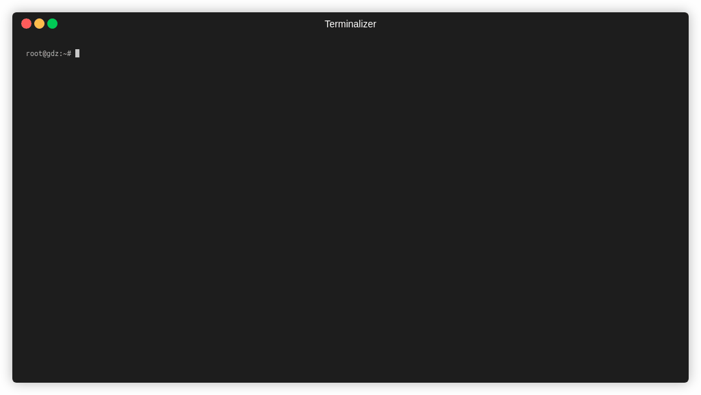

# Go Around : A tool to Query stackoverflow via terminal



## Overview

Go around uses the stackoverflow API to get the answers for the given query and display them in terminal.

## Installation

Download the binary corresponding to your platform from [releases](https://github.com/glendsoza/goaroundreleases/tag/v0.1) page

## Usage

```bash
./goaround -q "<your query>"
```

With environment variable

```bash
export STACKOVERFLOW_APP_KEY="<your app key>"
export STACKOVERFLOW_PAGE_SIZE=50
./goaround -q "<your query>"
```

## Configuration

Following environment can be used to configure the tool.

| Name                    | Required | Default | Description                                                                                                                                                                                                                                                                                    |
| ----------------------- | -------- | ------- | ---------------------------------------------------------------------------------------------------------------------------------------------------------------------------------------------------------------------------------------------------------------------------------------------- |
| STACKOVERFLOW_APP_KEY   | No       | -       | There is a limit on the number of calls that can be made to the stackoverflow api, by default 300 requests can be made per day, by providing API key this can be increased to 10000 requests per day. App can be registered [here](https://stackapps.com/apps/oauth/register) to get the App key  |
| STACKOVERFLOW_PAGE_SIZE | No       | 25      | Number of questions displayed in the terminal. By default its 25 and can be set upto 100                                                                                                                                                                                                       |

## Contributing

Following Features are planned to be added in the future but any help is welcome!

- Make the tool similar to [Rebound](https://github.com/shobrook/rebound)
- Provide button to copy the code from the answers to the clipboard
